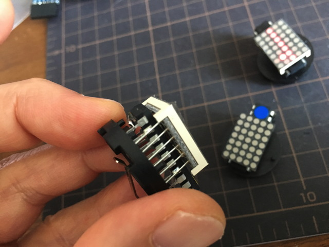

# piggybackLED
7x5 LED Matrix display with 3 parts

## 1. Introduction

Piggyback LED is simple LED Matrix driver. This can be use as badge which display messaes and patterns.
The idea of this project is based on a concept I called ‘Piggyback-computing’ which is just connect components on a CPU in piggyback style. 

## 2. Components

You need one attiny2313 (DIP package), one 5x7 LED matrix module(18mm or .7inch) , and one coin battery cell (CR2032).

The most important factor of 'piggyback computing' is pin assignments of CPU and other components, in this case LED matrix.

AVR is selected because it can drive LED directly. attiny2313 is selected because VCC and GND are assigned on the edges of the chip and I get 6 freely programmable pins on the both side of the chip.

## 3. Piggyback Connection

Just put LED-matrix module on attiny2313. Please note the alignment of CPU and LED pins. No soldering is necessary for tests.
  

## 4. Software

Customize 'matrix.c' to display what you want.
Makefile is used to compile the codes. You need to preprogram attiny2313 before connecting LED-matrix module.

In order to turn LED on, you need to connect VCC and GND to coin cell battery.

 

That's it.
